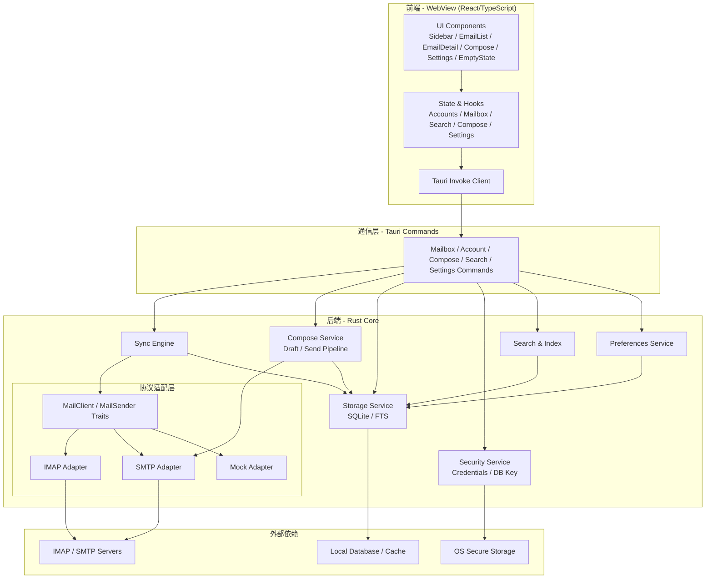

# Nexus Mail 系统架构设计

**基线文档**: `docs/prd.md`  
**文档目的**: 将 PRD 中的产品目标、功能需求、技术约束映射为可执行的系统架构边界。本文档不再承担项目进度记录职能，也不替代 PRD。
**当前对应版本**: PRD v1.2 (2026-04-30)

---

## 1. 架构目标

根据 `docs/prd.md`，Nexus Mail 的架构需要同时满足以下目标：

1. **现代化跨平台邮件客户端**：以 Tauri 为基础，在 macOS / Windows 优先可用，后续兼容 Linux。
2. **聚焦核心收发体验**：优先交付 IMAP 同步、SMTP 发送、多账户、列表、详情、撰写、回复/转发。
3. **多账户上下文清晰**：默认按账户分组浏览，所有列表、搜索、撰写与账号修复操作都必须带有明确账户上下文。
4. **安全与性能并重**：支持 TLS/SSL、凭据安全存储、本地搜索索引、HTML 安全渲染、远程图片隐私控制、较低资源占用。
5. **可扩展**：在不推翻核心架构的前提下，为搜索范围切换、附件预览、组织管理、主题模式、快捷键、设置中心等能力预留扩展点。

---

## 2. 总体分层架构

---

## 3. 需求到架构的映射

| PRD 需求 | 架构责任模块 | 说明 |
| --- | --- | --- |
| FR-001 IMAP 邮件同步 | `Sync Engine` + `IMAP Adapter` + `Storage Service` | 负责文件夹同步、邮件拉取、状态刷新、增量更新。 |
| FR-002 SMTP 发送邮件 | `SMTP Adapter` + `Compose Commands` | 负责撰写后的 MIME 生成、发送与失败回执。 |
| FR-003 多账户管理 | `Account Commands` + `Security Service` + `Storage Service` | 负责账户配置、凭据隔离、账户切换和本地元数据管理。 |
| FR-004 文件夹管理 | `Sync Engine` + `Storage Service` + `Sidebar UI` | 负责系统文件夹映射、自定义文件夹展示与生命周期管理（创建/重命名/删除），并同步未读数。 |
| FR-005 邮件列表展示 | `EmailList UI` + `Mailbox Hooks` + `Storage Service` | 负责列表加载、分组、滚动性能、未读/附件状态展示。 |
| FR-006 邮件详情查看 | `EmailDetail UI` + `IMAP Adapter` + Sanitization | 负责 HTML/纯文本渲染、头信息、附件列表与下载入口。 |
| FR-007 邮件撰写 | `Compose UI` + `SMTP Adapter` + 草稿存储 | 负责编辑器、附件添加、校验、草稿保存。 |
| FR-008 回复/转发 | `Compose UI` + Message Transform | 负责回填主题、引用正文、收件人策略。 |
| FR-009 搜索功能 | `Search & Index` + `Mailbox Hooks` | 负责本地索引、全文检索、结果过滤。 |
| FR-010 附件预览 | `Attachment Pipeline` + `EmailDetail UI` | 负责图片/PDF 预览、下载、内联资源处理。 |
| FR-011 邮件标记 | `Sync Engine` + `Storage Service` | 负责已读/未读、星标/旗标的本地与远程状态同步。 |
| FR-012 邮件拖拽组织 | `EmailList UI` + `Sidebar UI` + `Sync Engine` | 负责拖拽移动、目标文件夹校验和远程同步。 |
| FR-013 键盘快捷键 | `Frontend Shortcut Layer` | 负责列表导航、撰写、删除、搜索等交互快捷键。 |
| FR-014 主题模式 | `Theme Layer` + `Preferences Service` + `Settings UI` | 负责浅色/深色/跟随系统的主题切换。 |
| FR-015 设置中心 | `Settings UI` + `Preferences Service` + `Account Commands` | 负责主题、删除确认、同步配置、下载目录、远程图片策略、账号修复。 |
| FR-016 首次启动与空状态 | `EmptyState UI` + `Account Commands` + `Mailbox Hooks` | 负责无账号、空文件夹、无搜索结果、加载失败时的引导与恢复动作。 |

---

## 4. 核心模块边界

### 4.1 前端表现层
- 负责 PRD 中的三栏布局、账户分组侧栏、文件夹栏、邮件列表、详情页、撰写弹窗、设置页和空状态页。
- 负责当前账户上下文展示、发件账号可见性、精简搜索入口、加载/空态/错误态反馈，以及主题模式、快捷键等纯前端体验能力。
- 不直接访问数据库或网络协议，统一通过 Tauri Commands 调用后端。

### 4.2 通信层
- 统一暴露账户、文件夹、邮件、附件、搜索、设置等命令。
- 负责前后端数据结构的序列化边界，保证前端不感知 IMAP/SMTP 细节。
- 后续如需事件推送，可作为同步状态通知通道，但不改变命令式调用主路径。

#### 4.2.1 IPC 命令契约约束
1. 所有 Tauri command 参数 **使用 camelCase**（前端 `invoke` 统一同名）。
2. `invoke_handler` 必须注册前端所使用的命令（如 `move_emails`、`apply_email_action`、`search_emails_with_filters` 等），避免运行期 “command not found”。
3. 命令参数与返回结构变更必须同步更新前端调用与测试 mock。
4. 所有会改变账户上下文的命令必须显式携带 `accountId` 或能从资源 ID 唯一推导到账户，禁止使用隐式“当前账户”服务端全局状态。
5. Tauri v2 插件若涉及本地文件系统、对话框或外部打开能力，除前端 API 接线外，还必须同步声明对应 capability / permission scope；尤其是“用户通过保存对话框选择本地路径后写文件”这类流程，不能只依赖 `fs:default`，必须显式覆盖目标目录范围。

### 4.3 同步引擎
- 负责账户初始化同步、文件夹发现、邮件增量拉取、已读/旗标/删除/移动等状态回写。
- 负责账户状态刷新：`normal / error / re_auth_required`，并回填 `lastSync / lastError`。
- 需要满足 PRD 中的核心同步需求，并为后续离线队列或实时推送预留扩展点。
- 不负责 UI 组织，只输出结构化账户、文件夹、邮件与操作结果。

### 4.4 撰写与发送服务
- 负责草稿保存、回复/转发内容预生成、附件元数据收集、发送前校验、SMTP 发送与失败回退。
- v1 明确采用 **直接发送模型**：点击发送后立即调用 SMTP；成功写入已发送，失败保留草稿并返回可恢复错误。
- 不引入 Outbox 队列状态机，避免与 PRD v1.1 的发送定义冲突。

### 4.5 协议适配层
- `IMAP Adapter`：负责读取文件夹、邮件摘要、正文、附件与状态更新。
- `SMTP Adapter`：负责发信、认证与传输安全。
- `Mock Adapter`：用于测试与本地演示，必须保持与真实适配器一致的接口契约。

### 4.6 存储与索引层
- 持久化 PRD 中定义的 `Account / Folder / Email / Attachment / AppSettings` 实体。
- 支撑列表缓存、未读统计、搜索索引、草稿和设置项。
- 必须保证多账户隔离，不允许跨账户查询污染。

### 4.7 偏好与设置服务
- 负责主题模式、删除确认、下载目录、远程图片策略、搜索历史上限、同步间隔等本地偏好项的统一读写。
- 负责将“设置中心”与“详情页即时临时允许远程图片”这两类配置分离：前者持久化，后者为会话态或邮件态临时授权。

### 4.8 安全层
- 管理账户密码、数据库密钥与本地敏感配置。
- 支撑 PRD 中的“凭据安全存储”“本地加密”要求。
- 所有邮件 HTML 内容在进入渲染层前必须经过安全净化。
- 桌面版附件下载、导出等本地写文件能力属于受限高权限操作，必须通过 capability scope 最小化授权，并与保存对话框返回路径的运行时行为保持一致。

---

## 5. 关键业务流

### 5.1 账户接入
1. 前端收集邮箱地址、服务器配置、认证信息。
2. 自动发现成功则填充推荐配置；失败则切换到手动配置表单。
3. 后端执行连接测试与认证校验。
4. `Security Service` 保存凭据，`Storage Service` 建立账户记录。
5. `Sync Engine` 完成文件夹发现与初次同步。
6. 成功后前端进入该账户收件箱；失败时保留已填内容并展示可重试错误。

### 5.2 账号异常修复
1. `Sync Engine` 或认证流程检测到账户异常，更新 `Account.status` 与 `lastError`。
2. 侧栏账户分组与设置页同时显示错误标记。
3. 用户从设置中心或侧栏入口进入修复流程，选择重新认证、修改密码或编辑服务器配置。
4. 修复成功后触发增量同步并清理错误态。

### 5.3 列表与详情浏览
1. 用户切换账户或文件夹。
2. 前端请求本地缓存邮件列表，并按需加载更多。
3. 详情页读取正文、头信息、附件元数据。
4. HTML 内容经过净化后渲染；是否加载远程图片由 `remoteImagePolicy` 与临时授权共同决定。
5. 附件提供下载或预览入口；悬停预览仅作为列表轻量 peek，不改变当前详情面板内容。
6. 自定义文件夹可创建/重命名/删除；系统文件夹不可变更，删除当前文件夹后默认回退到收件箱。

### 5.4 撰写、回复与发送
1. 前端维护收件人、抄送、密送、主题、正文、附件状态和当前发件账号。
2. 回复/转发场景由消息转换逻辑生成默认内容，并继承原邮件账户上下文。
3. 草稿按周期自动保存，关闭窗口或切换页面前触发草稿保护。
4. 发送前执行校验，失败时按 PRD 要求保留到草稿并返回可重试原因。
5. 发送成功后写入已发送文件夹。

### 5.5 搜索与组织管理
1. 搜索基于本地索引完成主题、发件人、正文检索；当前前端入口固定为“当前文件夹”上下文。
2. 邮件列表头部只渲染搜索输入，不承载范围切换、过滤器、搜索历史或同步状态摘要。
3. 多选组织管理的顶部工具栏仅暴露“标为已读”和“删除”两个高频动作；移动、旗标、归档等能力继续走拖拽、详情动作或统一命令流。
4. 后续拖拽操作仍通过统一命令流落地，避免前端直接改本地状态而失真。

### 5.6 首次启动与空状态
1. 启动后先检查是否存在任何账户。
2. 若无账户，主工作区直接渲染欢迎页与“添加邮箱账户”主入口。
3. 若有账户但文件夹为空、搜索无结果或详情加载失败，则由各自场景容器渲染对应空状态与恢复动作。

---

## 6. 数据模型约束

本文沿用 `docs/prd.md` 的核心实体定义：

- **Account**：账户身份、服务器配置、认证方式、同步状态，扩展 `syncInterval / status / lastError / lastSync`。
- **Folder**：系统文件夹与自定义文件夹、未读数、远程映射。
- **Email**：主题、发件人、收件人、时间、摘要、正文、头信息、状态位，以及与账户上下文强绑定的查询键。
- **Attachment**：文件名、MIME、大小、内联标记、内容标识。
- **AppSettings**：主题模式、删除确认、默认下载目录、远程图片策略、搜索历史上限。

实现可以在字段层面做技术裁剪，但不得破坏 PRD 所要求的业务语义。

### 6.1 关键索引与隔离要求
- `accounts(email)`：同一设备内账号唯一性校验。
- `folders(account_id, remote_id)`：同一账户下文件夹映射唯一。
- `emails(account_id, folder_id, date desc)`：列表浏览与分页加载主索引。
- `emails(account_id, message_id)`：去重与详情定位。
- FTS 索引必须保留 `account_id` 过滤列，保证“当前账户 / 所有账户”搜索范围可控。

### 6.2 偏好与会话态分离
- 持久化设置进入 `AppSettings`。
- 当前选中账户、当前搜索态、临时允许远程图片等仅存在于前端会话态，不落入全局持久设置。

### 6.3 账户上下文不变式
1. `Email.account_id`、`Folder.account_id` 必须始终一致。
2. 撰写窗口中的 `fromAccountId` 必须显式存在，且发送接口不可依赖“最后一次选中账户”。
3. 搜索结果中的每条邮件都必须携带来源账户信息，供跨账户结果展示与后续操作使用。

---

## 7. 状态与接口约束

### 7.1 账户状态机

| 状态 | 含义 | 进入条件 | 可执行动作 |
| --- | --- | --- | --- |
| `normal` | 账户可正常同步和发信 | 配置有效且最近校验通过 | 同步、搜索、撰写、设置 |
| `error` | 网络或服务器异常导致暂时失败 | 超时、证书错误、服务器不可达 | 重试、编辑配置 |
| `re_auth_required` | 凭据失效或 OAuth 过期 | 认证失败、token 过期 | 重新认证、更新密码 |

### 7.2 撰写发送状态机

| 状态 | 含义 | 允许迁移 |
| --- | --- | --- |
| `editing` | 用户编辑中 | `savingDraft`, `sending`, `discarded` |
| `savingDraft` | 持久化草稿中 | `editing`, `draftSaved`, `sendFailed` |
| `draftSaved` | 草稿已保存 | `editing`, `sending` |
| `sending` | 正在 SMTP 发送 | `sent`, `sendFailed` |
| `sent` | 已发送成功 | 终态 |
| `sendFailed` | 发送失败且已保留草稿 | `editing`, `sending` |

### 7.3 IPC 接口分组

| 分组 | 典型命令 | 责任 |
| --- | --- | --- |
| Account | `discoverAccountConfig`, `saveAccount`, `repairAccount`, `listAccounts` | 账户接入、异常修复、账户列表 |
| Mailbox | `listFolders`, `listEmails`, `getEmailDetail`, `applyEmailAction`, `moveEmails` | 列表、详情、组织管理 |
| Compose | `createDraft`, `updateDraft`, `sendDraft`, `buildReplyDraft`, `buildForwardDraft` | 草稿与发送 |
| Search | `searchEmails`, `getSearchHistory`, `clearSearchHistory` | 搜索与历史 |
| Settings | `getAppSettings`, `updateAppSettings`, `refreshAccountNow` | 设置中心、同步与刷新 |

---

## 8. 非功能约束

### 8.1 性能
- 冷启动目标：< 2 秒
- 1000 封邮件列表加载：< 500ms
- 本地搜索响应：< 500ms
- 正常使用内存占用：< 200MB

### 8.2 安全
- IMAP / SMTP 传输要求 TLS 1.2+
- 本地存储要求加密
- 凭据不得以明文方式长期落盘
- HTML 邮件渲染必须经过净化
- 远程图片加载默认受隐私策略控制，禁止在未授权时自动泄露追踪请求

### 8.3 平台
- P0: Windows 10+、macOS 11+
- P1: Linux
- P2: iOS、Android

---

## 9. 与 PRD 对齐的实施优先级

本文不再记录“已完成/未完成”进度，只保留与 PRD 一致的优先级顺序：

| 阶段 | 目标 |
| --- | --- |
| M1 | 项目初始化与运行骨架 |
| M2 | 账户管理、协议连接、手动配置与账号修复 |
| M3 | 邮件同步、文件夹与列表展示 |
| M4 | 邮件详情、HTML 渲染、附件能力 |
| M5 | 撰写、回复/转发、发送、失败保留草稿、明确发件账号 |
| M6 | 当前文件夹搜索、精简搜索框与索引 |
| M7 | 移动、标记、归档、删除等组织管理，其中多选工具栏仅保留已读/删除 |
| M8 | 主题模式、设置中心、首次启动空状态、响应式布局、快捷键等体验增强 |
| M9 | 打包发布与跨平台交付 |

---

## 10. 文档使用规则

1. **需求变更先改 `docs/prd.md`**，再同步本文档。
2. 本文档只描述“为了满足 PRD，系统应如何组织”。
3. 当前实现状态、测试缺口、阶段性修复记录，不再写入本文档，应分别放在现状审计或开发记录中。
